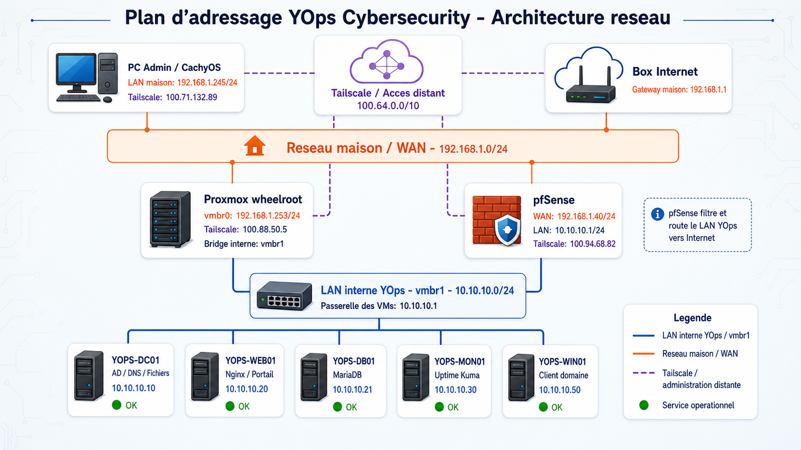

# YOps Cybersecurity - Documentation GitHub

Ce dossier regroupe les elements prets a etre presentes dans le depot GitHub du projet fil rouge INFRA.

## Contenu

- [Etat d'avancement infrastructure](README_INFRA_YOPS_ETAT_AVANCEMENT.md)
- [Schema reseau](assets/plan-adressage-yops.png)
- [Budget infrastructure](../docs/09_BUDGET_INFRASTRUCTURE.md)
- [Politique de securite](../docs/10_POLITIQUE_SECURITE_YOPS.md)
- [Cloud hybride et sauvegardes](../docs/11_CLOUD_HYBRIDE_BACKUP.md)
- [Plan VLAN cible](../docs/12_PLAN_SEGMENTATION_VLAN_CIBLE.md)

## Schema principal



## Resume

YOps Cybersecurity est une entreprise fictive de cybersecurite.  
L'infrastructure repose sur :

- Proxmox pour la virtualisation ;
- pfSense pour le pare-feu, le NAT et le routage ;
- Tailscale pour l'administration distante securisee ;
- Windows Server pour Active Directory, DNS, GPO et fichiers ;
- Linux pour le portail intranet, la base MariaDB et la supervision Uptime Kuma.

Point important : le lab actuel reste en LAN unique pour eviter de casser les services avant l'oral. La segmentation VLAN est documentee comme architecture cible.

L'etat detaille du projet est disponible dans le fichier :

```text
README_INFRA_YOPS_ETAT_AVANCEMENT.md
```
